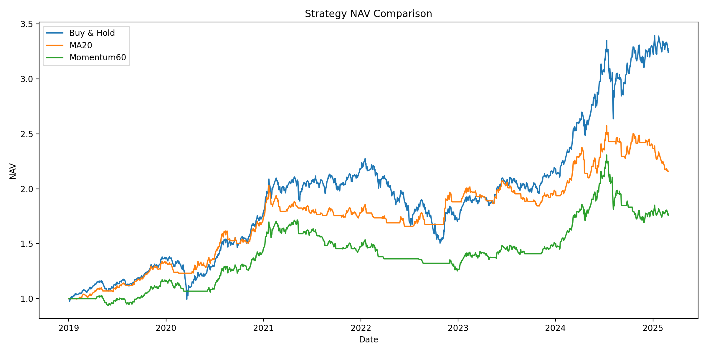
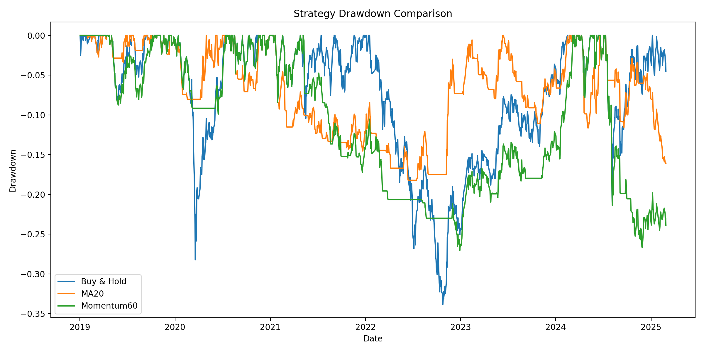
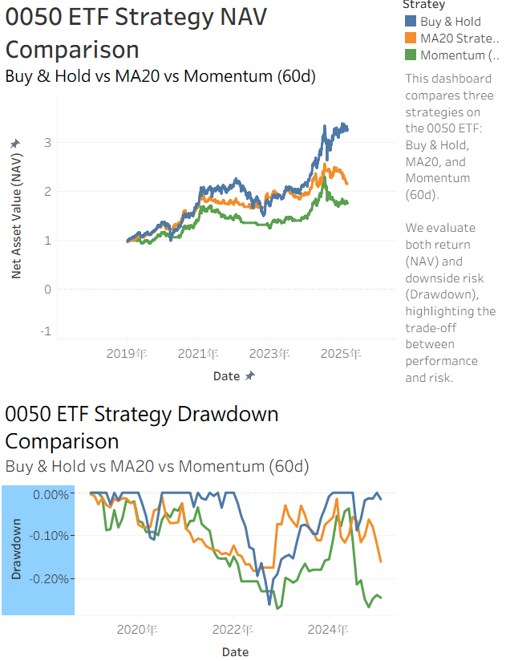

# 📊 Taiwan ETF Quantitative Strategy Analysis (0050)

## 📌 Project Overview
This project evaluates and compares three investment strategies on Taiwan ETF **0050**:

- Buy & Hold
- MA20 (Moving Average)
- Momentum (60-day)

The strategies are backtested using Python, and results are visualized using Tableau.

---

## ⚙️ Methodology

### Data
- Source: Yahoo Finance (via yfinance)
- Asset: 0050.TW
- Period: 2019–2025

### Strategy Logic

**1. Buy & Hold**
- Always fully invested

**2. MA20 Strategy**
- Buy when price > MA20
- Sell when price < MA20

**3. Momentum (60d)**
- Buy when 60-day return > 0
- Otherwise hold cash

### Backtesting Assumptions
- Initial capital: 1.0
- Fully invested or fully in cash
- Transaction costs included

---

## 📈 Results

### NAV Curve

### Drawdown Curve

---

## 📊 Tableau Dashboard

---

## 💡 Key Insights

- Buy & Hold achieves the highest return but suffers larger drawdowns  
- MA20 reduces volatility and downside risk  
- Momentum provides a balance between return and risk  

---

## 📁 Project Structure
